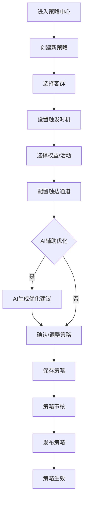
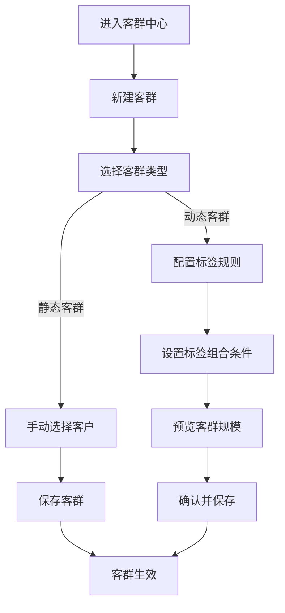
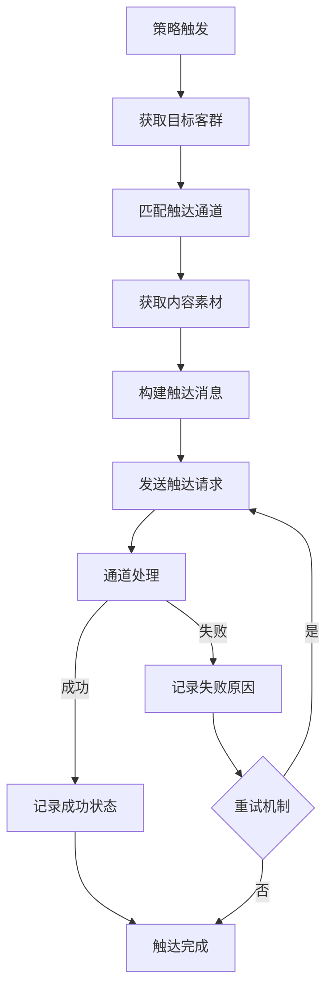

## 1. 产品概述

一款沉浸式AI营销体验平台，为银行及金融机构提供全链路智能化营销能力。平台整合客群管理、策略编排、事件触发、多渠道触达、内容管理、权益发放、活动运营及数据分析等核心功能，打造一站式营销闭环。

- **目标用户**: 银行营销人员、产品经理、运营人员
- **核心价值**: 通过AI驱动的智能化营销，提升客户转化率、降低运营成本、实现精准触达

## 2. 核心功能

### 2.1 用户角色

| 角色 | 核心权限 |
|------|----------|
| 管理员 | 系统配置、用户管理、全局监控 |
| 营销人员 | 客群管理、策略创建、活动运营 |
| 数据分析员 | 报表查看、数据导出、趋势分析 |
| 渠道管理员 | 渠道配置、触达管理、状态监控 |

### 2.2 功能模块

1. **客群中心**: 标签组合圈客、静态/动态客群管理
2. **策略中心**: 策略画布编排、AI辅助编排、策略生命周期管理
3. **事件中心**: 行为事件、实时业务事件、延时业务事件管理
4. **触达中心**: 短信、外呼、企微渠道接入与管理
5. **内容中心**: 素材、话术管理，内容版本控制
6. **产品中心**: 产品信息管理、产品关联配置
7. **权益中心**: 权益创建、发放规则、核销管理
8. **活动中心**: 活动自定义搭建、活动状态管理
9. **分析中心**: 单策略/多策略分析、效果评估、报表导出

### 2.3 页面详情

| 页面名称 | 模块名称 | 功能描述 |
|----------|----------|----------|
| 首页 | 数据概览 | 展示核心指标、策略概览、触达统计 |
| 客群中心 | 客群列表 | 客群查询、创建、编辑、删除 |
| 客群中心 | 标签管理 | 标签分类、标签规则配置 |
| 客群中心 | 客群详情 | 客群成员查看、导出 |
| 策略中心 | 策略列表 | 策略查询、状态管理 |
| 策略中心 | 策略画布 | 可视化编排、AI辅助建议 |
| 事件中心 | 事件列表 | 事件查询、创建、编辑 |
| 事件中心 | 事件监控 | 实时事件流、处理状态 |
| 触达中心 | 渠道管理 | 渠道配置、接入状态 |
| 触达中心 | 触达记录 | 触达日志、状态追踪 |
| 内容中心 | 素材管理 | 素材上传、分类、版本控制 |
| 内容中心 | 话术管理 | 话术模板、变量配置 |
| 产品中心 | 产品列表 | 产品查询、创建、编辑 |
| 产品中心 | 产品关联 | 产品与权益/活动关联 |
| 权益中心 | 权益列表 | 权益查询、创建、编辑 |
| 权益中心 | 核销记录 | 权益核销管理、统计 |
| 活动中心 | 活动列表 | 活动查询、状态管理 |
| 活动中心 | 活动搭建 | 活动配置、规则设置 |
| 分析中心 | 策略分析 | 单策略效果分析 |
| 分析中心 | 多策略对比 | 策略效果对比分析 |
| 分析中心 | 报表导出 | 数据报表生成与导出 |

## 3. 核心流程

### 3.1 策略创建流程

### 3.2 客群圈选流程

### 3.3 触达流程

## 4. 用户界面设计

### 4.1 设计风格

- **主色调**: 深蓝色系 (#0F172A, #1E293B)，搭配科技感紫色 (#8B5CF6) 作为强调色
- **辅助色**: 绿色 (#10B981) 表示成功/有效，橙色 (#F59E0B) 表示警告，红色 (#EF4444) 表示错误
- **按钮风格**: 圆角矩形，主按钮渐变背景，悬停时有发光效果
- **字体**: 标题使用 Inter 粗体，正文使用 Inter 常规字重
- **布局**: 左侧导航 + 右侧内容区，卡片式布局，多层次阴影营造深度感
- **图标**: 使用 Lucide React 图标库

### 4.2 页面设计概览

| 页面名称 | 模块名称 | UI元素 |
|----------|----------|--------|
| 首页 | 数据概览 | 统计卡片、趋势图表、快捷入口 |
| 客群中心 | 客群列表 | 表格、筛选器、创建按钮 |
| 客群中心 | 标签管理 | 标签树、规则配置面板 |
| 策略中心 | 策略画布 | 可视化节点编辑器、连线、AI建议面板 |
| 事件中心 | 事件监控 | 实时事件流、状态指示器 |
| 触达中心 | 渠道管理 | 渠道卡片、状态开关、配置按钮 |
| 内容中心 | 素材管理 | 素材网格、上传组件、预览弹窗 |
| 活动中心 | 活动搭建 | 表单配置、规则设置、预览区域 |
| 分析中心 | 报表展示 | 图表组件、数据卡片、导出按钮 |

### 4.3 响应式设计

- **桌面端**: 完整功能展示，左侧导航，右侧内容区
- **平板端**: 收起左侧导航为图标模式，保持核心功能可见
- **移动端**: 底部导航栏，核心功能入口，简化页面布局

### 4.4 交互动效

- 页面切换: 淡入淡出 + 滑动效果
- 按钮悬停: 缩放 + 阴影增强
- 卡片悬停: 上浮 + 边框高亮
- 表单提交: 加载动画 + 成功反馈
- 图表加载: 渐进式数据展示
- AI辅助建议: 脉冲动画吸引注意力
