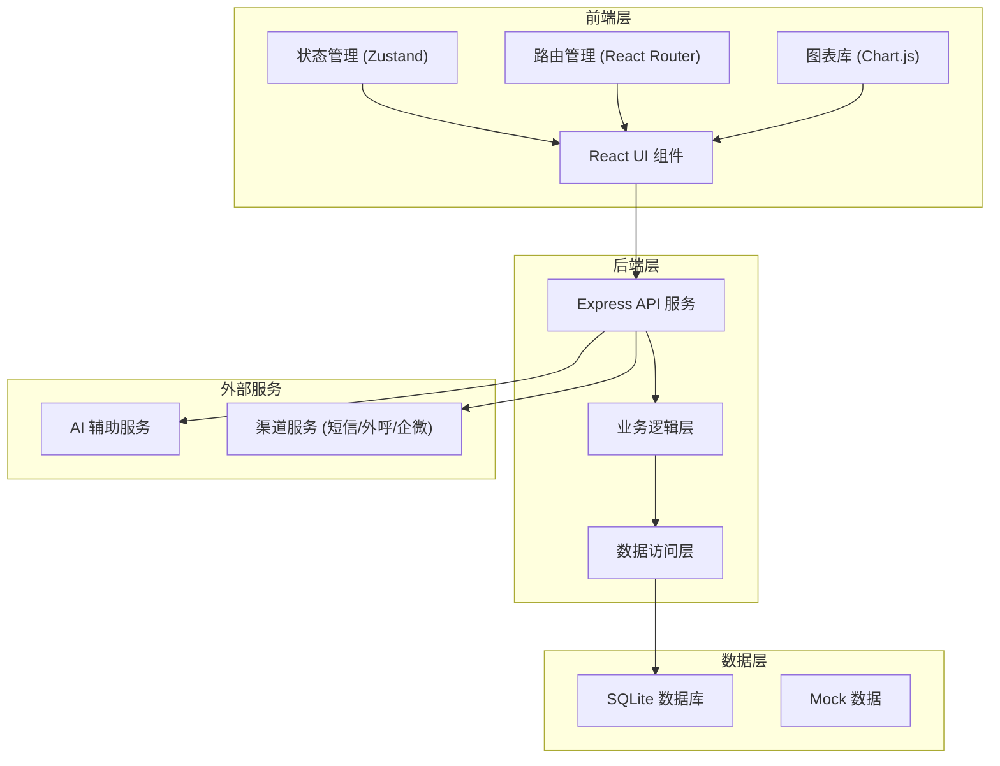
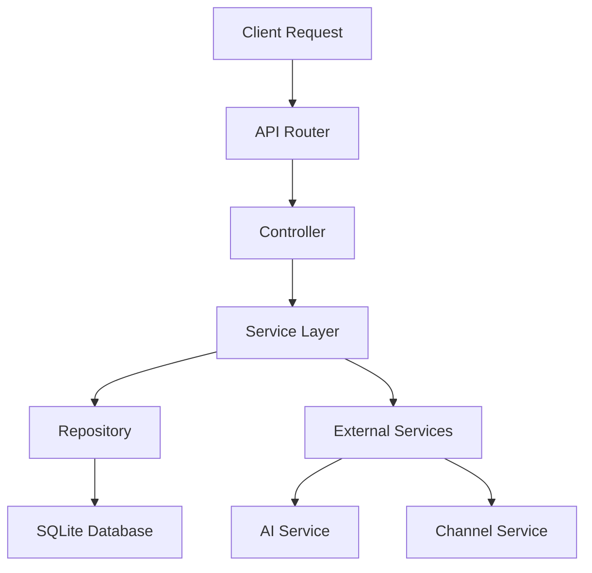
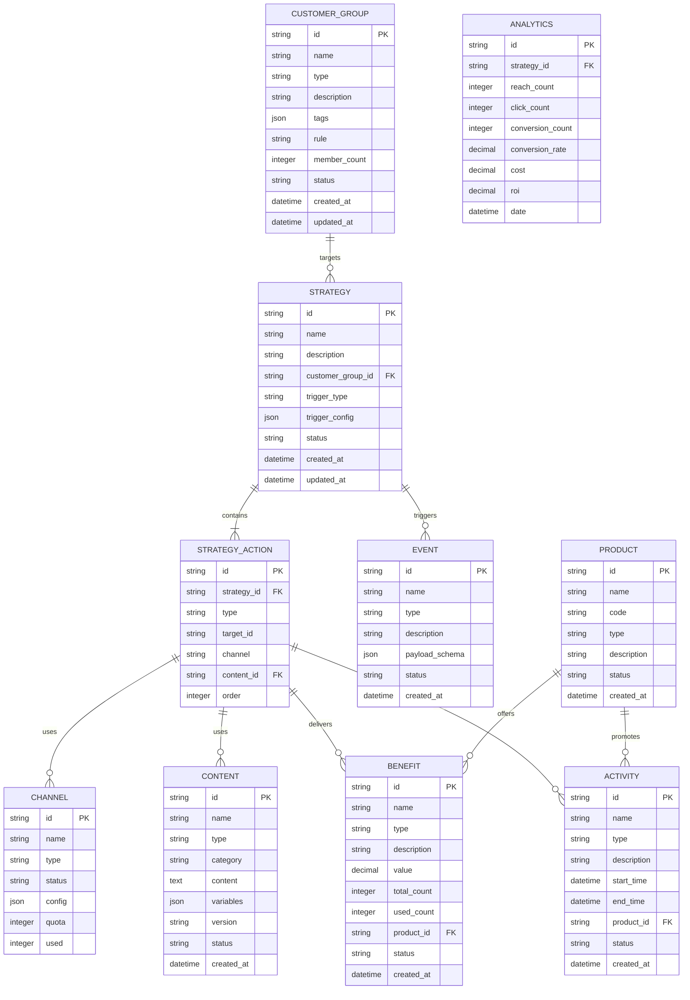

## 1. 架构设计



## 2. 技术栈描述

- **前端**: React@18 + TypeScript + TailwindCSS@3 + Vite
- **状态管理**: Zustand
- **路由**: React Router DOM
- **图表**: Chart.js + react-chartjs-2
- **图标**: Lucide React
- **后端**: Express@4 + TypeScript
- **数据库**: SQLite
- **初始化工具**: vite-init

## 3. 路由定义

| 路由 | 用途 | 组件 |
|------|------|------|
| `/` | 首页数据概览 | Dashboard |
| `/customer-groups` | 客群中心 | CustomerGroups |
| `/customer-groups/create` | 创建客群 | CreateCustomerGroup |
| `/customer-groups/:id` | 客群详情 | CustomerGroupDetail |
| `/strategy` | 策略中心 | StrategyCenter |
| `/strategy/create` | 创建策略 | CreateStrategy |
| `/strategy/:id` | 策略详情 | StrategyDetail |
| `/events` | 事件中心 | EventCenter |
| `/events/create` | 创建事件 | CreateEvent |
| `/channels` | 触达中心 | ChannelCenter |
| `/content` | 内容中心 | ContentCenter |
| `/products` | 产品中心 | ProductCenter |
| `/benefits` | 权益中心 | BenefitCenter |
| `/activities` | 活动中心 | ActivityCenter |
| `/analytics` | 分析中心 | AnalyticsCenter |

## 4. API 定义

### 4.1 客群相关 API

```typescript
interface CustomerGroup {
  id: string;
  name: string;
  type: 'static' | 'dynamic';
  description: string;
  tags: string[];
  rule: string;
  memberCount: number;
  status: 'active' | 'inactive';
  createdAt: string;
  updatedAt: string;
}

// GET /api/customer-groups - 获取客群列表
// POST /api/customer-groups - 创建客群
// GET /api/customer-groups/:id - 获取客群详情
// PUT /api/customer-groups/:id - 更新客群
// DELETE /api/customer-groups/:id - 删除客群
```

### 4.2 策略相关 API

```typescript
interface Strategy {
  id: string;
  name: string;
  description: string;
  customerGroupId: string;
  triggerType: 'event' | 'schedule' | 'api';
  triggerConfig: object;
  actions: StrategyAction[];
  status: 'draft' | 'review' | 'active' | 'paused' | 'ended';
  createdAt: string;
  updatedAt: string;
}

interface StrategyAction {
  type: 'benefit' | 'activity' | 'message';
  targetId: string;
  channel: 'sms' | 'call' | 'wechat';
  contentId: string;
}

// GET /api/strategies - 获取策略列表
// POST /api/strategies - 创建策略
// GET /api/strategies/:id - 获取策略详情
// PUT /api/strategies/:id - 更新策略
// POST /api/strategies/:id/publish - 发布策略
// POST /api/strategies/:id/pause - 暂停策略
```

### 4.3 事件相关 API

```typescript
interface Event {
  id: string;
  name: string;
  type: 'behavior' | 'business' | 'delayed';
  description: string;
  payloadSchema: object;
  status: 'active' | 'inactive';
  createdAt: string;
}

// GET /api/events - 获取事件列表
// POST /api/events - 创建事件
// GET /api/events/:id - 获取事件详情
// PUT /api/events/:id - 更新事件
// DELETE /api/events/:id - 删除事件
```

### 4.4 渠道相关 API

```typescript
interface Channel {
  id: string;
  name: string;
  type: 'sms' | 'call' | 'wechat';
  status: 'active' | 'inactive';
  config: object;
  quota: number;
  used: number;
}

// GET /api/channels - 获取渠道列表
// POST /api/channels - 创建渠道
// PUT /api/channels/:id - 更新渠道配置
// POST /api/channels/:id/toggle - 切换渠道状态
```

### 4.5 内容相关 API

```typescript
interface Content {
  id: string;
  name: string;
  type: 'material' | 'script';
  category: string;
  content: string;
  variables: string[];
  version: string;
  status: 'draft' | 'approved' | 'rejected';
  createdAt: string;
}

// GET /api/content - 获取内容列表
// POST /api/content - 创建内容
// GET /api/content/:id - 获取内容详情
// PUT /api/content/:id - 更新内容
```

### 4.6 产品相关 API

```typescript
interface Product {
  id: string;
  name: string;
  code: string;
  type: string;
  description: string;
  status: 'active' | 'inactive';
  createdAt: string;
}

// GET /api/products - 获取产品列表
// POST /api/products - 创建产品
// GET /api/products/:id - 获取产品详情
// PUT /api/products/:id - 更新产品
```

### 4.7 权益相关 API

```typescript
interface Benefit {
  id: string;
  name: string;
  type: string;
  description: string;
  value: number;
  totalCount: number;
  usedCount: number;
  status: 'active' | 'inactive';
  createdAt: string;
}

// GET /api/benefits - 获取权益列表
// POST /api/benefits - 创建权益
// GET /api/benefits/:id - 获取权益详情
// PUT /api/benefits/:id - 更新权益
```

### 4.8 活动相关 API

```typescript
interface Activity {
  id: string;
  name: string;
  type: string;
  description: string;
  startTime: string;
  endTime: string;
  status: 'draft' | 'active' | 'ended';
  createdAt: string;
}

// GET /api/activities - 获取活动列表
// POST /api/activities - 创建活动
// GET /api/activities/:id - 获取活动详情
// PUT /api/activities/:id - 更新活动
```

### 4.9 分析相关 API

```typescript
interface AnalyticsData {
  strategyId: string;
  reachCount: number;
  clickCount: number;
  conversionCount: number;
  conversionRate: number;
  cost: number;
  roi: number;
  date: string;
}

// GET /api/analytics/strategy/:id - 获取策略分析数据
// GET /api/analytics/compare - 多策略对比分析
// GET /api/analytics/report - 获取汇总报表
```

## 5. 服务器架构图



## 6. 数据模型

### 6.1 ER 图



### 6.2 数据库初始化

数据库使用 SQLite，初始数据通过 mock 数据文件生成，包含示例客群、策略、事件、渠道、内容、产品、权益和活动数据。

## 7. 项目结构

```
.
├── api/                     # 后端代码
│   ├── src/
│   │   ├── controllers/     # API 控制器
│   │   ├── services/        # 业务逻辑层
│   │   ├── repositories/    # 数据访问层
│   │   ├── models/          # 数据模型
│   │   ├── routes/          # 路由定义
│   │   ├── middleware/      # 中间件
│   │   └── index.ts         # 服务器入口
│   └── package.json
├── src/                     # 前端代码
│   ├── components/          # 通用组件
│   │   ├── Layout/          # 布局组件
│   │   ├── Charts/          # 图表组件
│   │   ├── Forms/           # 表单组件
│   │   ├── Tables/          # 表格组件
│   │   └── Common/          # 通用组件
│   ├── pages/               # 页面组件
│   │   ├── Dashboard/       # 首页
│   │   ├── CustomerGroups/  # 客群中心
│   │   ├── Strategy/        # 策略中心
│   │   ├── Events/          # 事件中心
│   │   ├── Channels/        # 触达中心
│   │   ├── Content/         # 内容中心
│   │   ├── Products/        # 产品中心
│   │   ├── Benefits/        # 权益中心
│   │   ├── Activities/      # 活动中心
│   │   └── Analytics/       # 分析中心
│   ├── stores/              # Zustand 状态管理
│   ├── api/                 # API 客户端
│   ├── utils/               # 工具函数
│   ├── types/               # TypeScript 类型定义
│   └── index.tsx            # 应用入口
├── .trae/documents/         # 文档目录
├── package.json
├── vite.config.ts
├── tsconfig.json
└── tailwind.config.js
```
